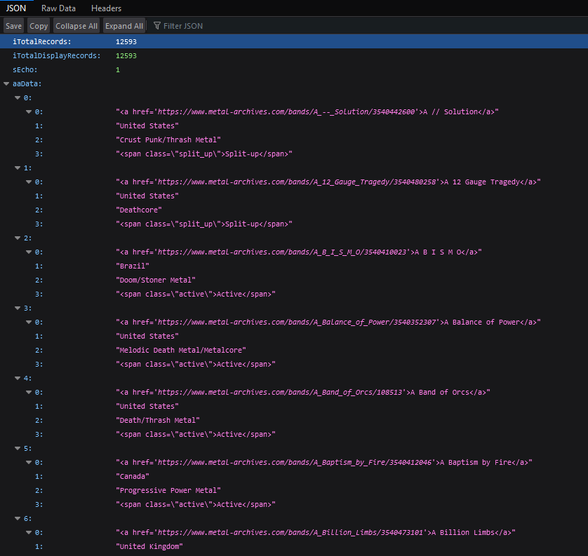

# Scraping Websites with Python

In [my last post](https://github.com/z3c0/blog/blob/main/tech/scraping_websites_with_python/scraping_metallum-0.md), we covered how to analyze a website as a target for web-scraping (in this case, [metal-archives.com](https://metal-archives.com)). In this post, we're going to use the requirements we created to code a solution.

## Part 2: Extacting the Data (using Requests and Pandas)

### The Requirements

**Step 1**: Loop over the endpoint `/browse/ajax-letter/l/{LETTER}/json/1?sEcho=1&iDisplayStart=0&iDisplayLength=500` where `LETTER` is a value from
`[A, B, C, D, E, F, G, H, I, J, K, L, M, N, O, P, Q, R, S, T, U, V, W, X, Y, Z, NBR, ~]`

**Step 2**: At each iteration of **Step 1**, increment `iDisplayStart` by `iDisplayLength` until `iDisplayStart` is greater than `iTotalRecords`, grabbing records from each endpoint.

***

### **Step 1**: Creating The Endpoints

Let's start by creating the basic structure for our script, which we're naming `metallum.py`.

```python
# metallum.py

def download_metal_bands():
    """Get every band from Encyclopaedia Metallum using the website API"""
    pass


if __name__ == '__main__':
    download_metal_bands()

```

If `__name__ == '__main__'` is new to you, this condition checks whether the current file is the entry point for your program. This helps determine when your script is being run individually (*eg* `python metallum.py`), or when it's being imported as a module (*eg* `import metallum`).

Next, lets initialize any constants that we know we're going to need later.

```python
# metallum.py

ALPHABET = ['A', 'B', 'C', 'D', 'E', 'F', 'G', 'H', 'I', 'J', 'K', 'L', 'M',
            'N', 'O', 'P', 'Q', 'R', 'S', 'T', 'U', 'V', 'W', 'X', 'Y', 'Z',
            'NBR', '~']  # the alphabet, according to metal archives

def download_metal_bands():
    """Get every band from Encyclopaedia Metallum using the website API"""
    pass


if __name__ == '__main__':
    download_metal_bands()

```

`ALPHABET` is a list containing each option defined in **Step 1**.

Looking further at **Step 1**, we can see that we're going to need a way to easily parameterize our endpoints. This is best done via an additional function, as shown below.

```python
# metallum.py

ALPHABET = ['A', 'B', 'C', 'D', 'E', 'F', 'G', 'H', 'I', 'J', 'K', 'L', 'M', 'N', 'O',
            'P', 'Q', 'R', 'S', 'T', 'U', 'V', 'W', 'X', 'Y', 'Z', 'NBR', '~']


def _create_metallum_api_endpoint(letter, offset, page_size):
    """Returns an API endpoint for retrieving a segment of bands
    beginnging with the given letter"""

    endpoint = f'browse/ajax-letter/l/{letter}/json'
    query_string = f'sEcho=1&iDisplayStart={offset}&iDisplayLength={page_size}'

    return f'https://www.metal-archives.com/{endpoint}?{query_string}'


def download_metal_bands():
    """Get every band from Encyclopaedia Metallum using the website API"""
    pass


if __name__ == '__main__':
    download_metal_bands()

```

Let's assemble the pieces that we've created so far. Inside the `download_metal_bands()` function, add the following code.

```python
def download_metal_bands():
    """Get every band from Encyclopaedia Metallum using the website API"""

    for letter in ALPHABET:
        letter_endpoint = _create_metallum_api_endpoint(letter, 0, 500)
        print(letter_endpoint)
```

When you run your script, you should see twenty-eight endpoints printed to your console, each corresponding to an item stored in `ALPHABET`. Navigating to one of these endpoints should return a page of JSON, as shown below.



Believe it or not, we've already finished implementing **Step 1**. Let's move on to **Step 2**.

***

### **Step 2a**: Making HTTP Requests

Of the two steps **Step 2**. Before beginning, let's review our criteria:

At each iteration of **Step 1**, increment `iDisplayStart` by `iDisplayLength` until `iDisplayStart` is greater than `iTotalRecords`, grabbing records from each endpoint. To make testing our code easier, lets only focus on the first endpoint. We can do this by adding a `break` into our loop, instructing it to stop after the first run.

```python
def download_metal_bands():
    """Get every band from Encyclopaedia Metallum using the website API"""

    for letter in ALPHABET:
        letter_endpoint = _create_metallum_api_endpoint(letter, 0, 500)
        print(letter_endpoint)

        break
```

We have yet to obtain the `iTotalRecords` value, and as we can see in the requirements, it's necessary to know how many times we need to increment `iDisplayStart`. This is a good place for us to start.

To retrieve `iTotalRecords` for each letter, we're going to need to send a request to each of our endpoints. For this, we're going to use `requests` package. This is a third-party package that doesn't come with python, so we'll need to install it using `pip`

```bash
python -m pip install requests
```

Once `requests` is installed, let's `import` it.

```python
# metallum.py
import requests

ALPHABET = ['A', 'B', 'C', 'D', 'E', 'F', 'G', 'H', 'I', 'J', 'K', 'L', 'M', 'N', 'O',
            'P', 'Q', 'R', 'S', 'T', 'U', 'V', 'W', 'X', 'Y', 'Z', 'NBR', '~']

```

Next, let's update our `download_metal_bands()` function.

```python
def download_metal_bands():
    """Get every band from Encyclopaedia Metallum using the website API"""

    headers = {'User-Agent': 'python-3.9'}

    for letter in ALPHABET:
        letter_endpoint = _create_metallum_api_endpoint(letter, 0, 500)
        letter_page = requests.get(letter_endpoint, headers=headers)

        if letter_page.status_code != 200:
            error_text = \
                f'{letter_page.status_code}: {letter_page.text[:500]}'
            raise Exception(error_text)

        print(letter_page.text[:500])

        break
```

Firstly, we added a new variable called `headers` containing a `User-Agent` string of `python-3.9`. You could pass in any value you want here, but we're specifying our python version as a way of being polite. This helps the website's administrators understand what methods people are using to interface with the site. Since they're being courteous enough to provide a free service for us, this is the least that we can do.

Next, we utilize the `get` function of the `requests` module. As the name implies, this sends an HTTP `GET` request to the specified endpoint.

Finally, we're checking the status code of the response. This informs us as to whether or not our request was successful. If you get a status code of anything but `200`, it is likely due to a problem with your request. If you get a `403: Forbidden` error, make sure that your headers are typed correctly.

When you run your script now, you should see the following output to your console.

```cmd
{ 
        "iTotalRecords": 12594,
        "iTotalDisplayRecords": 12594,
        "sEcho": 1,
        "aaData": [
                        [ 
                        "<a href='https://www.metal-archives.com/bands/A_--_Solution/3540442600'>A // Solution</a>", 
                        "United States",
                        "Crust Punk/Thrash Metal",
                        "<span class=\"split_up\">Split-up</span>"
                ]
                                ,
                                        [ 
                        "<a href='https://www.metal-archives.com/bands/A_12_Gauge_Tragedy/3540480258'>A 12 Gauge Tragedy</a>", 
                        "United States",
                        "Deathcore",
                        "<span class=\"split_up\">Split-up</span>"
                ]

```

As expected, we're seeing raw JSON return from the endpoint. We're now ready to begin parsing the data.

***

### **Step 2b**: Parsing JSON

Parsing JSON data with Python is an extremely task, and is typically done via the [`json`](https://docs.python.org/3/library/json.html) module. This is a standard Python library, so it does not need to be installed with `pip`. Let's go ahead and `import` it.

```python
import json
import requests

ALPHABET = ['A', 'B', 'C', 'D', 'E', 'F', 'G', 'H', 'I', 'J', 'K', 'L', 'M',
            'N', 'O', 'P', 'Q', 'R', 'S', 'T', 'U', 'V', 'W', 'X', 'Y', 'Z',
            'NBR', '~']
```

To convert our JSON text to a `json` object, we can use the [`.loads()`](https://docs.python.org/3/library/json.html#json.loads) function. Once your data has been converted to a JSON object, you should have no trouble extracting the `iTotalRecords` value.

To make sure everything is working as intended, let's temporarily remove the `break` statement that we added earlier.

```python
    headers = {'User-Agent': 'python-3.9'}

    for letter in ALPHABET:
        letter_endpoint = _create_metallum_api_endpoint(letter, 0, 500)
        letter_page = requests.get(letter_endpoint, headers=headers)

        if letter_page.status_code != 200:
            error_text = \
                f'{letter_page.status_code}: {letter_page.text[:500]}'
            raise Exception(error_text)

        json_data = json.loads(letter_page.text)
        total_records = json_data['iTotalRecords']

        print(f'{letter}: {total_records}')

```

We now have an idea of how much data exists for each letter.

```cmd
A: 12611
B: 8624
C: 8834
D: 12296
E: 6673
F: 5186
G: 4628
H: 5980
I: 5479
J: 940
K: 3561
L: 4430
M: 10041
N: 5840
O: 3603
P: 5898
Q: 243
R: 4945
S: 15664
T: 6513
U: 1926
V: 4124
W: 4059
X: 425
Y: 374
Z: 836
NBR: 423
~: 2005
```

## **Step 2c**: Retrieving the Data

To download the data from each letter, we only need to make some minor changes. Within our `for` loop, we're going to add an additional `while` loop that we will use to increment the `iDisplayStart` parameter of our endpoint. More specically, we'll be mimicking the logic of `do..while` by using `while True` and a conditional at the end of the `while` loop's body.

```python
    headers = {'User-Agent': 'python-3.9'}
    page_size = 500

    for letter in ALPHABET:
        offset = 0
        total_records = None
        band_records = []

        while True:
            letter_endpoint = \
                _create_metallum_api_endpoint(letter, offset, page_size)
            letter_page = requests.get(letter_endpoint, headers=headers)

            if letter_page.status_code != 200:
                error_text = \
                    f'{letter_page.status_code}: {letter_page.text[:500]}'
                raise Exception(error_text)

            json_data = json.loads(letter_page.text)
            band_records.append(json_data['aaData'])

            if offset == 0:
                total_records = json_data['iTotalRecords']

            offset += page_size

            if offset <= total_records:
                continue

            break

        break  # let's re-add our break statement from earlier

```

To finish, let's save our data for each letter before moving on to the next. We can quickly dump our data to a CSV file by using the [`pandas`](https://pandas.pydata.org/) package.

Before we can do so, we'll need to install it with `pip`.

```cmd
python -m pip install pandas
```

```python
import json
import requests
import pandas as pd

ALPHABET = ['A', 'B', 'C', 'D', 'E', 'F', 'G', 'H', 'I', 'J', 'K', 'L', 'M',
            'N', 'O', 'P', 'Q', 'R', 'S', 'T', 'U', 'V', 'W', 'X', 'Y', 'Z',
            'NBR', '~']
```

At the bottom of your `ALPHABET` loop, load `band_records` into a [`DataFrame`](https://pandas.pydata.org/pandas-docs/stable/reference/api/pandas.DataFrame.html#pandas-dataframe) with the following columns.

1) band

1) country

1) genre

1) status

Afterwards, you can easily write the data to a CSV with the [`to_csv()`](https://pandas.pydata.org/pandas-docs/stable/reference/api/pandas.DataFrame.html#pandas-dataframe) method. Be sure to set the write mode to `'a'` for "append". After you've tested your changes, go ahead remove the `break` statement at the end of the `ALPHABET` loop.

```python
    headers = {'User-Agent': 'python-3.9'}
    page_size = 500
    csv_headers = ('band', 'country', 'genre', 'status')

    for letter in ALPHABET:
        offset = 0
        total_records = None
        band_records = []

        while True:
            letter_endpoint = \
                _create_metallum_api_endpoint(letter, offset, page_size)
            letter_page = requests.get(letter_endpoint, headers=headers)

            if letter_page.status_code != 200:
                error_text = \
                    f'{letter_page.status_code}: {letter_page.text[:500]}'
                raise Exception(error_text)

            json_data = json.loads(letter_page.text)
            band_records += json_data['aaData']

            if offset == 0:
                total_records = json_data['iTotalRecords']

            offset += page_size

            if offset <= total_records:
                continue

            break

        bands_df = pd.DataFrame(band_records, columns=csv_headers)
        bands_df.to_csv('bands.csv', mode='a', index=False)

```

With this, we're almost finished. Before downloading the entire dataset, we'll want to make sure we're accounting for an errored run by truncating our target file before writing data to it. This way, a repeated run won't duplicate any data that may already exist in the file.

This can be done succinctly by opening and closing the file with the `'w'` write mode.

```python
    headers = {'User-Agent': 'python-3.9'}
    page_size = 500
    csv_headers = ('band', 'country', 'genre', 'status')

    open('bands.csv', 'w').close()
```

Our script is complete.

```python
import json
import requests
import pandas as pd

ALPHABET = ['A', 'B', 'C', 'D', 'E', 'F', 'G', 'H', 'I', 'J', 'K', 'L', 'M',
            'N', 'O', 'P', 'Q', 'R', 'S', 'T', 'U', 'V', 'W', 'X', 'Y', 'Z',
            'NBR', '~']


def _create_metallum_api_endpoint(letter, offset, page_size):
    """Returns an API endpoint for retrieving a segment of bands
    beginnging with the given letter"""

    endpoint = f'browse/ajax-letter/l/{letter}/json'
    query_string = f'sEcho=1&iDisplayStart={offset}&iDisplayLength={page_size}'

    return f'https://www.metal-archives.com/{endpoint}?{query_string}'


def download_metal_bands():
    """Get every band from Encyclopaedia Metallum using the website API"""

    headers = {'User-Agent': 'python-3.9'}
    page_size = 500
    csv_headers = ('band', 'country', 'genre', 'status')

    open('bands.csv', 'w').close()

    for letter in ALPHABET:
        offset = 0
        total_records = None
        band_records = []

        while True:
            letter_endpoint = \
                _create_metallum_api_endpoint(letter, offset, page_size)
            letter_page = requests.get(letter_endpoint, headers=headers)

            if letter_page.status_code != 200:
                error_text = \
                    f'{letter_page.status_code}: {letter_page.text[:500]}'
                raise Exception(error_text)

            json_data = json.loads(letter_page.text)
            band_records += json_data['aaData']

            if offset == 0:
                total_records = json_data['iTotalRecords']

            offset += page_size

            if offset <= total_records:
                continue

            break

        bands_df = pd.DataFrame(band_records, columns=csv_headers)
        bands_df.to_csv('bands.csv', mode='a', index=False)


if __name__ == '__main__':
    download_metal_bands()

```

***

After this excercise, you should feel more comfortable with reverse-engineering web APIs, making web requests, and parsing JSON data. If you want to learn more about how you can speed up your script, check back in a week for the next installment in this series: *Extacting the Data Faster (with multi-threading)*
